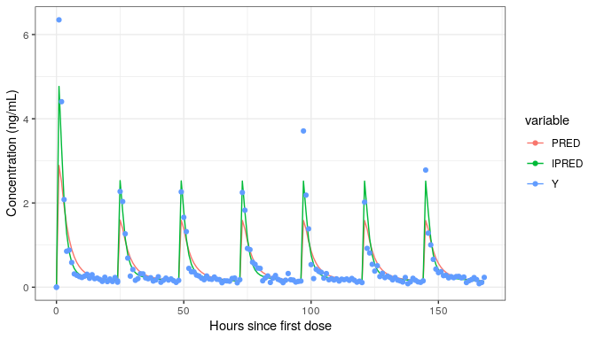
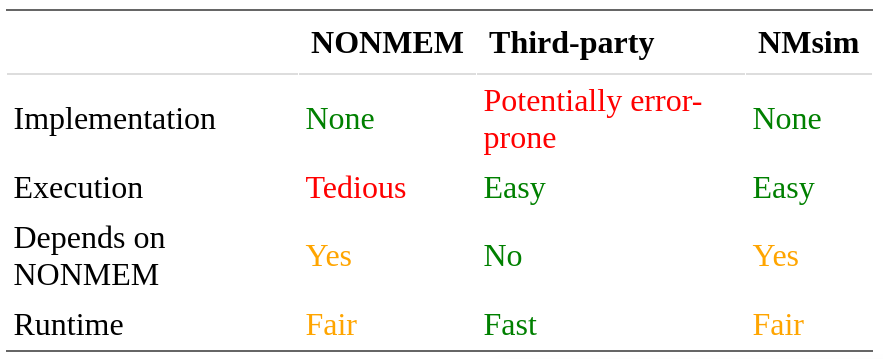

<!-- README.md is generated from README.Rmd. Please edit that file -->

# NMsim<a href='https://NMautoverse.github.io/NMsim/'></a>

<!-- badges: start -->

[](https://lifecycle.r-lib.org/articles/stages.html)
[](https://CRAN.R-project.org/package=NMsim)
[](https://cran.r-project.org/package=NMsim)
[](https://app.codecov.io/gh/NMautoverse/NMsim?branch=main)
[](https://github.com/NMautoverse/NMsim/actions)
<!-- badges: end -->

Please make sure to read this at
[`The NMsim website`](https://NMautoverse.github.io/NMsim/) where you
can browse several vignettes with examples on specific topics.

`NMsim` is an R package that can simulate Nonmem models (using the
`NMsim` function) based on just a simulation data set and a path to an
estimation control stream. It will retrive and combine output tables
with input data once Nonmem has finished and return the results to R.

The interface is “seamless” or fully integrated in R. Run a simulation
of the (estimated) model stored in “path/to/file.mod” using the
simulation input data set stored in the variable `data.sim` this way:

``` r
simres <- NMsim(file.mod="/path/to/file.mod",
                data=data.sim)
```

You will quickly learn to do this on your own models, but if you can’t
wait to see this working, you can do the following:

``` r
data.sim <- read.csv(system.file("examples/derived/dat_sim1.csv",package="NMsim"))
simres <- NMsim(file.mod=system.file("examples/nonmem/xgxr021.mod",package="NMsim"),
                data=data.sim,
                dir.sims=".")
```

where `dir.sims` may be needed because the model in this case may be in
a read-only location.

Notice, that could be any working Nonmem model as long as the provided
simulation data set is sufficient to run it. We are ready to plot:

``` r
library(ggplot2)
datl <- as.data.table(simres) |>
    melt(measure.vars=cc(PRED,IPRED,Y))

ggplot(datl,aes(TIME,value,colour=variable))+
    geom_line(data=function(x)x[variable!="Y"])+
    geom_point(data=function(x)x[variable=="Y"])+
    labs(x="Hours since first dose",y="Concentration (ng/mL)")
```



This example was a simulation of a multiple dose regimen with a loading
dose using a model estimated on single dose data. It is from the first
vignette
[`NMsim-intro.html`](https://NMautoverse.github.io/NMsim/articles/NMsim-intro.html).
Go there next to get started with `NMsim`.

## Motivation

While NONMEM offers great flexibility for estimation of PK and PK/PD
models, many users find the simulation features in NONMEM insufficient
and turn to alternative software for simulation. This leads to
additional work of model reimplementation, with risk of the simulation
model deviating from the estimated model, due to bugs in the
reimplementation. For a wide range of model types, the limitation is not
in NONMEM’s ability to perform such simulations, but rather in the lack
of a simple user-interface to obtain the simulations.
[`NMsim`](https://cran.r-project.org/package=NMsim) provides such an
interface as an R package, allowing the modeler to simulate models as
soon as an estimate is available.

The goal for NMsim is to automate the NONMEM simulation workflow and
provide a simple, flexible, and powerful R interface. This allows for
automation of most simulation-based analyses.



## Supported types of simulations

`NMsim` has a flexible way to define simulation methods. The following
methods are currently provided:

-   Simulation of new subjects (default or explicitly with
    `method.sim=NMsim_default`)
-   Simulation of subjects already estimated in Nonmem model
    (`method.sim=NMsim_EBE`)
-   Simulation with parameter uncertainty based on a Nonmem covariance
    step (`method.sim=NMsim_VarCov` and `method.sim=NMsim_NWPRI`)
-   Simulation “as is” in case you already prepared a simulation control
    stream and just want to automate the use of it in combination with
    simulation data sets (`method.sim=NMsim_asis`)

In addition, `NMsim` provides other features to further modify the
simulation control stream

-   Simulation of typical subjects with all ETAs equal 0
    (`typical=TRUE`)
-   Custom modification of control stream sections (`modify.sections`
    argument)

To learn how to run these simulations on your Nonmem models, get started
with
[`NMsim-intro.html`](https://NMautoverse.github.io/NMsim/articles/NMsim-intro.html).
It is really easy.

In addition, `NMsim` can simulate multiple models at a time. E.g., if a
bootstrap run of a model is available, NMsim can run the simulation with
each of the bootstrap models and collect all the results in one dataset.
This provides a robust and easy way to simulate a Nonmem model with
uncertainty.

You can also write your own methods, if you have some other Nonmem-based
simulation (or other job) you want to automate using `NMsim`.

Many features are available. Prominent ones are:

-   Can update and edit parameter values using the `inits` argument.
-   Can very flexibly modify the simulation control stream on the fly
    through the simple `modify.model` argument.
-   Provides a simple interface `NMreadSim()` to read previously
    performed simulation results. Automatically stores results in a
    compressed format that can be separated from intermediate results
    files.
-   Results on file can be reused if available using
    `reuse.results=TRUE`.
-   Can use submit jobs to clusters. It can wait for the simulations to
    be done and automatically collect the results like in the example
    above.
-   Simulation replicates using Nonmem `SUBPROBLEMS` feature avaible
    through the `subproblems` argument
-   Simulations of models on transformed observations can be
    automatically transformed back using the `transform` argument.

If residual variability is not implemented in the simulated model,
`NMsim` provides a way (`addResVar()`) to add residual variability in R
after the simulation has been run.

## How NMsim works

`NMsim` does not simulate, translate or otherwise interpret a NONMEM
model. Instead, it automates the NONMEM simulation workflow (including
execution of NONMEM) and wraps it all into one R function. Provided with
a path to a NONMEM control stream and a data.frame to simulate, `NMsim`
will do the following:

-   Save the simulation input data in a csv file for NONMEM
-   Create a simulation input control stream based on `file.mod`
    (`$INPUT` and `$DATA` matching the saved simulation data set;
    `$SIMULATE` instead of `$ESTIMATION` and `$COVARIANCE`)
-   Update and fix initial values based on estimate (from `file.ext`)
-   Run NONMEM on the generated simulation control stream
-   Collect output data tables, combine them, and merge with the
    simulation input data
-   Return the collected data in R

`NMsim` can call NONMEM directly or via `PSN`. If `NMsim` is run on a
system where NONMEM cannot be executed, `NMsim` can still prepare the
simulation control stream and datafile.

`NMsim` is in itself a relatively small R package. It makes extensive
use of functionality to handle NONMEM data and control streams provided
by the R package [`NMdata`](https://cran.r-project.org/package=NMdata).

## Supported model types

The methods currently provided by `NMsim` will work with (many or most)
Pop PK models and most continuous-scale PD models. Methods are currently
not provided for for time-to-event models. Also, depending on the coding
of the models, other censored data models may not work out of the box,
because the model may not have a single variable (in Nonmem) that
simulates the wanted information for all data rows, as their
interpretation may depend on other values.

The input data set must contain whatever variables are needed by the
Nonmem model. A common issue is if the Nonmem model uses a covariate
that is not in the simulation input data set. `NMdata`’s
[NMcheckData](https://NMautoverse.github.io/NMdata/reference/NMcheckData.html)
is a good help identifying input data issues before running Nonmem - and
when Nonmem acts unexpectedly.

## NMsim and speed

Nonmem may not be the fastest simulator out there. But actually most
often, the reason Nonmem is slow at providing a simulation result is
that it takes a long time writing the `$TABLE` files (yes, that can
account for 90% or more of the time Nonmem spends). `NMsim` provides a
simple way to get around this. The argument `text.table` can be used to
define only the columns needed in the simulation output (which may be as
little as `PRED`, `IPRED`, and a couple more - remember the input data
is merged back automatically). As a result, `NMsim` may still be slower
than a re-implementation in a different framework. But it’s extremely
easy to do.

## Requirements

NMsim is dependent on running Nonmem. Often, that will mean Nonmem must
be available on the same system as the one running R. However, if Nonmem
is run on a separate system through `qsub` or in another way initiates
Nonmem on another system, that will work too. Then however, only if R
can read the file system where Nonmem writes the results, it can
retrieve the results.

NMsim does not need PSN but can use it. However, not all features are
available with PSN, so for some features you will have to specify the
path to the Nonmem executable (say `path.nonmem=/path/to/nmfe75` or any
Nonmem executable you want to use). Specifically of the simulation types
currently available, simulation of known subjects is not possible using
PSN (but works if a Nonmem executable is provided).

If PSN is used, `NMsim` uses PSN’s `execute` to run models. In addition,
`NMsim` by default uses PSN’s `update_inits` to update initial values in
control streams, if PSN is available. `NMsim` does also include its own
simple function to do this if `PSN` is not available.

## Is `NMsim` reliable?

Importantly, `NMsim` does not (at least not by default) modify,
translate or simulate the model itself. It does modify control stream
sections `$INPUT`, `$DATA`, `$ESTIMATION`, `$SIMULATION`, `$THETA`,
`$OMEGA`, `$SIGMA`, `$TABLE` as needed. The fact that `NMsim` allows for
skipping the re-implementation but just uses Nonmem to simulate the
Nonmem model as is, eliminates the risk of discrepancies between the
estimated model and the simulated model.

The produced control stream is saved together with simulation data set
open for manual inspection and can obviously be run with Nonmem
independently of `NMsim`.

## Easily create simulation datasets

`NMsim` includes functions (`NMcreateDoses` and `addEVID2`) to very
easily create simulation data sets. While one certainly does not need to
use these functions to use `NMsim`, they do add to the package providing
a framework that enables a complete simulation workflow in only 5-15
simple lines of R code.

## Run Nonmem from R

There are several other packages out there that can do this, and `NMsim`
may not be your best choice if this feature is all you are looking for.
However, running Nonmem using the `NMexec()` function provided by
`NMsim` has one important advantage in that it saves the input data
together with the Nonmem control streams. This ensures that output data
can be merged with input data as it went into the model, even if the
input data file should be modified or lost.

-   Saves input data with Nonmem model
-   Provides a simple R command for submission of Nonmem jobs
-   Optionally handles cluster configuration
-   Saves the xml file by default

`NMexec` will submit model runs to a cluster by default. This can be
switched off for running Nonmem locally. Please notice the jobs are
submitted to a cluster in a very specific way using `PSN`. If your setup
is different, this is for now not supported. Please use
`NMexec(sge=FALSE)` in that case (which may not be desirable). Notice
that simulations are not done on a cluster by default so you may still
be able to use `NMsim`.

## Install

`NMsim` is on CRAN, MPN and github:

``` r
## From CRAN/MPN repositories
install.packages("NMsim")
## From github
library(remotes)
install_github("NMautoverse/NMsim")
```
